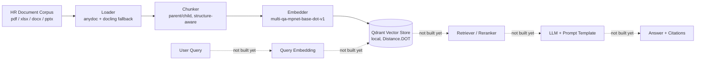

# Enterprise_RAG_System

> An in-development Retrieval-Augmented Generation system being built against a 20-document
> synthetic HR/People-Ops corpus (offer letters, employment contracts, payroll, performance
> reviews, policy memos, and more) spanning pdf/xlsx/docx/pptx. The ingestion side — loading,
> chunking, embedding, and vector storage — is implemented and covered by a 20-check UAT health
> suite; retrieval and generation are not built yet.

[]()
[]()

---

## Table of Contents
- [Overview](#overview)
- [Architecture](#architecture)
- [Repository Structure](#repository-structure)
- [Configuration](#configuration)
- [Getting Started](#getting-started)
- [Pipeline Logic](#pipeline-logic)
  - [1. Data Loading](#1-data-loading)
  - [2. Chunking](#2-chunking)
  - [3. Embedding](#3-embedding)
  - [4. Retrieval](#4-retrieval)
  - [5. Generation](#5-generation)
- [Evaluation](#evaluation)
- [Project Status](#project-status)
- [Roadmap](#roadmap)
- [Challenges & Decisions Log](#challenges--decisions-log)
- [Security & Responsible AI](#security--responsible-ai)
- [Contributing](#contributing)
- [License](#license)

---

## Overview

This repo is building a RAG system over a 20-document synthetic HR corpus (employee master data,
offer letters, employment contracts, job descriptions, onboarding checklists, the employee
handbook, leave/attendance, payroll, performance reviews, org chart, recruitment tracker,
interview scorecards, exit/offboarding, training certification, POSH compliance, compensation
benchmarking, engagement survey, disciplinary records, policy memos, and insurance enrollment —
see `input_backend_data/data_source/`).

"Production-grade" here currently means: every pipeline parameter (paths, chunk sizes, model
name, collection name) is read from one typed settings object instead of being hardcoded anywhere
(`scripts/backend/backend_settings.py`), the loader guards against oversized/zip-bomb files before
parsing them, and a standalone UAT script (`scripts/backend/injection_pipeline_testing.py`)
independently re-verifies every stage's output and cross-stage consistency — rather than a
notebook that only ever gets run once on a demo.

Retrieval and generation are **not implemented yet** — see [Pipeline Logic](#pipeline-logic) and
[Project Status](#project-status).

## Architecture



Solid arrows = implemented and UAT-tested. Dotted arrows = not built yet.

**Components at a glance:**

| Stage | Tool / Library | Notes |
|---|---|---|
| Loader | `anydoc` (primary) + `docling` (OCR-capable fallback) | parses pdf/xlsx/docx/txt/md; falls back to the secondary parser if the primary one raises |
| Chunker | custom parent/child splitter (`chunker.py`) + `tiktoken` (`cl100k_base`) for token counts | header/table/banner-aware section splitting, then token-budget packing |
| Embedding model | `sentence-transformers` — `multi-qa-mpnet-base-dot-v1` | 768-dim, dot-product-tuned; only child chunks are embedded |
| Vector store | `qdrant-client`, embedded/local-mode (no server) | `Distance.DOT` to match the embedding model; collection is wiped and rebuilt once per ingestion run |
| Retriever | *not yet implemented* | `scripts/backend/retrieval/` and `retrieval_pipeline.py` are empty scaffolding |
| LLM / Generation | *not yet implemented* | `experiments/` has an unrelated early Ollama/Groq sandbox, not wired to this corpus |
| Orchestration | plain sequential Python (`rag_ingestion_pipeline.py`) | no framework (no LangChain/LlamaIndex) — each stage runs in its own try/except |

## Repository Structure

```
.
├── scripts/
│   ├── backend/
│   │   ├── backend_settings.py            # pydantic settings - single source of truth for every path/size/model name
│   │   ├── execution_statistics.py        # wall time / CPU / peak RAM / project-disk delta around a pipeline run
│   │   ├── rag_ingestion_pipeline.py      # entrypoint: loader -> chunker -> embedder -> vector_db, in sequence
│   │   ├── injection_pipeline_testing.py  # standalone UAT health-check suite for the ingestion pipeline
│   │   ├── ingestion/
│   │   │   ├── loader.py                  # file discovery + safety checks + parsing (anydoc / docling)
│   │   │   ├── chunker.py                 # parent/child chunking -> chunked_document.db (SQLite)
│   │   │   ├── embedder.py                # sentence-transformers embedding of child chunks
│   │   │   ├── vector_db.py               # Qdrant (embedded, local-mode) collection reset + upsert + query
│   │   │   └── output/                    # loaded_document.json, chunked_document.db, vector_db/, cached model weights
│   │   ├── retrieval/                     # empty - retrieval stage not started
│   │   └── retrieval_pipeline.py          # empty - retrieval stage not started
│   └── __init__.py
├── src/enterprise_rag_system/             # uv package stub ("Hello from enterprise-rag-system!") - not wired to the pipeline above
├── experiments/                           # scratch notebooks: Ollama/qwen3 agent sandbox + a Groq-based LinkedIn-post prompt chain
├── input_backend_data/data_source/        # the 20 sample HR documents used as the ingestion corpus
├── architecture_files/                    # empty - reserved for diagrams
├── main.py                                # imports scripts.backend.backend_server / scripts.frontend.frontend_server - neither exists yet, so this isn't runnable
├── change_log.md
├── requirements.txt                       # pip deps actually used by the ingestion pipeline (docling, anydoc, qdrant-client, sentence-transformers, pydantic, fastapi/uvicorn, pyarrow, filetype)
├── pyproject.toml / uv.lock                # uv-managed deps for the src/enterprise_rag_system stub (currently just `ollama`) - not yet consolidated with requirements.txt
└── .env                                    # groq_api_key - used only by experiments/, not by the ingestion pipeline
```

## Configuration

Every value below is a pydantic default in `scripts/backend/backend_settings.py` and is read live
from a single `settings` object everywhere it's used — nothing in the ingestion pipeline or the
UAT suite hardcodes a path, size, or model name.

| Parameter | Value | Why |
|---|---|---|
| `database_file_Path` | `input_backend_data/data_source` | source folder the loader recursively scans |
| `acceptable_file_agreement` | `pdf, xlsx, docx, txt, md` | supported formats; anything else is filtered out before parsing |
| `json_save_path` | `scripts/backend/ingestion/output/loaded_document.json` | loader output — one JSON record per parsed file |
| `parent_chunk_size` / `parent_chunk_overlap` | `3000` / `500` tokens | parent chunks keep broad context around a retrieved child |
| `child_chunk_size` / `child_chunk_overlap` | `500` / `150` tokens | child chunks are the unit that actually gets embedded and (eventually) retrieved |
| `chunked_documents_save_path` | `scripts/backend/ingestion/output/chunked_document.db` | SQLite file storing both parent and child chunks |
| `embedding_model_name` | `multi-qa-mpnet-base-dot-v1` | sentence-transformers model, 768-dim, trained for **dot-product** similarity, not cosine |
| `embedding_model_save_path` | `scripts/backend/ingestion/output` | local cache dir the model is downloaded into once |
| `vector_db_save_path` | `scripts/backend/ingestion/output/vector_db` | Qdrant's on-disk, embedded (no-server) storage |
| `collection_name` | `rag_chunks` | the single Qdrant collection everything is stored in |

There's no `.env`-driven override for any of the above yet. The one real `.env` variable in this
repo, `groq_api_key`, belongs to the unrelated `experiments/` sandbox (via `langchain_groq`), not
to the ingestion pipeline.

## Getting Started

> **Note:** this repo currently has two separate, not-yet-consolidated dependency setups.
> `requirements.txt` is what the ingestion pipeline (everything under `scripts/backend/ingestion/`)
> actually needs. The `uv`-managed `pyproject.toml`/`uv.lock` only declares `ollama` today and is
> tied to the unrelated `src/enterprise_rag_system` stub. Install `requirements.txt` into whichever
> environment you run the commands below from.

```bash
# 1. Install the ingestion pipeline's dependencies
pip install -r requirements.txt

# 2. Run the full ingestion pipeline end to end (loader -> chunker -> embedder -> vector store)
#    from the repo root, so the `scripts.backend...` absolute imports resolve
python -m scripts.backend.rag_ingestion_pipeline

# 3. Run the UAT health check against the pipeline's output
python -m scripts.backend.injection_pipeline_testing --stage all

# ...or one stage at a time, with a report written to disk
python -m scripts.backend.injection_pipeline_testing --stage vectorstore --sample-size 20 --report-path report.json
```

There is no `query` command yet — the retrieval and generation stages don't exist, so there's
nothing downstream of the vector store to query against.

## Pipeline Logic

### 1. Data Loading
*(`scripts/backend/ingestion/loader.py`)*

- **Discovery:** recursively scans `database_file_Path` for files whose extension is in
  `acceptable_file_agreement`. Anything else is filtered out before any parsing is attempted.
- **Safety checks**, run before a file's bytes are ever read: an on-disk size cap (50 MB), and for
  zip-based office formats (docx/xlsx/pptx/odt/epub/...) an uncompressed-size and
  compression-ratio check to reject zip-bomb-style files, read from the zip's central directory
  only — nothing is extracted to check it.
- **Parsing:** primary parser is `anydoc` (format sniffed from the file's bytes, falling back to
  its filename extension); if that raises, falls back to `docling` (OCR-capable). The extracted
  text's token count is computed with `tiktoken` (`cl100k_base`).
- **Concurrency:** a `ThreadPoolExecutor` runs one consumer (`save_to_json`) draining a queue that
  producer functions feed. Only `load_all_local_files` is implemented today;
  `load_all_sharepoint_files`, `load_all_google_drive_files`, and `load_all_one_notes_files` are
  stubs (they just `time.sleep`) reserved for future source connectors.
- **Output:** a flat JSON array of `{"text_content", "token count"}` records, written with
  `O_TRUNC` and owner-only file permissions on every write — so re-running the loader fully
  replaces the file rather than appending to it.
- **Known gaps** (surfaced by the UAT suite, not yet fixed — see
  [Challenges & Decisions Log](#challenges--decisions-log)): records carry no filename/doc
  identifier (no `doc_name`/`author`/`mode_of_parse`), and the writer currently targets a
  hardcoded path instead of the configured `json_save_path`.

### 2. Chunking
*(`scripts/backend/ingestion/chunker.py`)*

- **Two-level strategy:** parent chunks (3000 tokens / 500 overlap) for broad context, child
  chunks (500 tokens / 150 overlap) carved out of each parent for retrieval granularity.
- **Structure-aware splitting before token packing:** documents are first split into sections on
  markdown headers (`#`/`##`/`###`) and on repeated letterhead/banner lines (common in
  Docling-rendered multi-section reports); within a section, markdown tables are split into
  row-groups (capped at 400 tokens each), re-prefixed with the table's header + separator row so
  column meaning survives the split — a table row is never cut mid-way.
- **Packing:** the resulting units (paragraphs or table row-groups) are greedily packed into
  parent, then child, chunks up to the configured token budget, carrying forward trailing units as
  overlap into the next chunk.
- **Storage:** `chunked_document.db` — a local SQLite file with one `chunks` table (`uuid` PK,
  self-referencing `parent_id` FK, `chunk_type`, `text_content`, `tokens`, `doc_name`, `author`,
  `mode_of_parse`, plus `embedding_vector`/`embedding_vector_name` added later by the embedder).
  The FK is enforced at insert time, so orphaned children can't occur.
- **Idempotency:** the database file is deleted and recreated once at the start of each process
  run, so re-running the chunker never leaves duplicate rows behind.

### 3. Embedding
*(`scripts/backend/ingestion/embedder.py`)*

- **Model:** `multi-qa-mpnet-base-dot-v1` (`sentence-transformers`), 768 dimensions, trained for
  dot-product similarity rather than cosine. Downloaded once via `huggingface_hub.snapshot_download`
  into `embedding_model_save_path`, then loaded from that local cache on every subsequent run.
- **Scope:** only **child** chunks are embedded — parent chunks are retained purely to give a
  retrieved child more surrounding context; they're never embedded or searched directly.
- **Process:** batches child chunks out of SQLite, encodes each one's text, and writes the
  resulting vector (JSON-encoded) plus the model name back into the same row.
- **Vector storage** (`scripts/backend/ingestion/vector_db.py`): embedded child chunks are then
  upserted into a local, embedded Qdrant collection (`Distance.DOT`, matching the model). The
  collection is wiped and rebuilt once per process run before upserting — this mirrors the same
  truncate-and-rebuild convention the loader and chunker already use, and fixes an earlier bug
  where re-running ingestion kept accumulating stale points under newly-regenerated chunk uuids
  (see [Challenges & Decisions Log](#challenges--decisions-log)).

### 4. Retrieval
**Not yet implemented.** `scripts/backend/retrieval/` and `scripts/backend/retrieval_pipeline.py`
exist only as empty scaffolding.

The vector-store side is ready for it: the Qdrant collection is already configured with
`Distance.DOT` to match the embedding model, and `injection_pipeline_testing.py`'s own query smoke
test (check `V5`) already demonstrates querying it with `query_points()` — that's the pattern a
real retriever would build on.

### 5. Generation
**Not yet implemented.** No LLM call, prompt template, or guardrail code exists against the
ingested HR corpus yet.

`experiments/` has an unrelated, early-stage sandbox: a Groq-backed (`langchain_groq`) prompt chain
for drafting LinkedIn articles (`prompt_inventory.py`, `notebook001.py`), and an Ollama/`qwen3:0.6b`
notebook (`ai_agents.ipynb`) exploring local-model agent behavior. Neither is wired to this corpus
or this pipeline.

## Evaluation

There's no retrieval-quality or generation-quality evaluation yet, since neither stage is built.
What exists instead is a UAT health suite for the ingestion pipeline:
`scripts/backend/injection_pipeline_testing.py` runs 20 independently-checkable requirements
(file-discovery coverage, chunk size/overlap compliance, parent-child linkage integrity, embedding
coverage/dimensionality/determinism, vector-store reconciliation, full cross-stage traceability,
and more) against whatever the pipeline last produced, and prints a pass/warn/fail/skip verdict
for each.

| Metric / Check | Method | Last known result |
|---|---|---|
| Ingestion pipeline health (20 requirement checks, L1–X4) | `injection_pipeline_testing.py --stage all` | 18 pass / 5 warn / 1 fail / 1 skip |
| Retrieval precision@k | *n/a* | retrieval stage not implemented |
| Answer faithfulness / relevancy | *n/a* | generation stage not implemented |
| End-to-end latency | partial — `execution_statistics.py` tracks wall time / CPU / peak RAM / disk delta for a full ingestion run | tracked per run, not yet baselined |

## Project Status

**Done**
- [x] Loading pipeline for pdf/xlsx/docx/txt/md from a local filesystem source, with file-safety checks
- [x] Parent/child chunking, structure- and table-aware
- [x] Embedding generation (child chunks only) and local Qdrant vector-store integration
- [x] UAT health-check suite covering all four ingestion stages plus cross-stage reconciliation

**In Progress**
- [ ] Closing the gaps the UAT suite surfaced: loader doesn't populate `doc_name`/`author`/`mode_of_parse`; loader's output path doesn't match its own configured `json_save_path`
- [ ] Connector stubs for SharePoint / Google Drive / OneNote (currently just `time.sleep` placeholders in `loader.py`)

**Not Started**
- [ ] Retrieval (vector search, hybrid search, reranking, access-control filtering)
- [ ] Generation (prompt templates, LLM calls, citation formatting, guardrails)
- [ ] `main.py` / `backend_server.py` / `frontend_server.py` application wiring — `main.py` currently imports modules that don't exist in this repo yet
- [ ] Consolidating `requirements.txt` and the `uv`-managed `pyproject.toml`/`uv.lock` into one dependency setup

## Roadmap

**Short-term:** build the retrieval stage against the existing Qdrant collection (vector search,
then top-k filtering); fix the loader's metadata gap so a future retriever can cite a real source
document; wire `main.py` to the actual ingestion pipeline instead of the missing
`backend_server`/`frontend_server` modules.

**Longer-term:** generation + guardrails, hybrid search/reranking, access-control-aware retrieval,
real SharePoint/Drive/OneNote connectors, and consolidating the two dependency setups.

## Challenges & Decisions Log

### Vector store accumulated stale points across ingestion runs
**Problem:** The chunker assigns a brand-new random `uuid` to every chunk on every run, but
`vector_db.py` only ever upserted into the Qdrant collection and never cleared it — so re-running
ingestion kept adding points under new IDs instead of replacing the old ones. A UAT run caught this
directly: 430 stored vectors against only 215 actually-embedded chunks.
**Tried:** Deleting the collection and immediately recreating it on the same client looked correct
in the code, but a Windows-specific quirk in `qdrant-client`'s local (embedded) mode left the old
`storage.sqlite` file on disk, so the next `create_collection()` silently reattached to the stale
data instead of starting fresh.
**Resolved:** Added `_reset_collection_once()` in `vector_db.py` — wipes and rebuilds the collection
once per process run, mirroring the truncate-and-rebuild convention `loader.py` and `chunker.py`
already use, with a short poll-then-force-remove guard on the physical collection directory to work
around the Windows timing issue. Verified by running the real vector-store step twice in a row:
count stayed at 215 both times instead of growing.

### Loader doesn't carry a document identifier through the pipeline
**Problem:** `loaded_document.json` records only ever contain `text_content` and `token count` — no
filename, author, or parse mode — so every downstream chunk's `doc_name`/`author`/`mode_of_parse`
is null. That blocks per-document UAT checks (overlap verification, full-pipeline traceability) and
would block a future retriever from citing a real source document.
**Status:** open. Currently just documented and surfaced as a warning by the UAT suite
(requirements L4, C2, C4, X1) rather than worked around, since fixing it means changing the
loader's output schema.

### UAT suite needed to survive a partially-broken environment
**Problem:** This machine's Windows Application Control policy blocks the native DLLs that
`tiktoken` and `torch` depend on — which also happens to block parts of the real
`loader.py`/`chunker.py`/`embedder.py`. An early version of `injection_pipeline_testing.py` imported
those modules unconditionally at the top level and crashed outright the moment either was blocked.
**Resolved:** Each ingestion module is now imported defensively — a stage whose module fails to
import reports a clean `fail` with the real `ImportError` text for just that stage's checks,
instead of taking the whole report down with it.

### A naive chunk-count estimate doesn't match this corpus's real output
**Problem:** The UAT suite's chunk-to-source reconciliation check (C5) estimates expected chunk
counts as `total tokens / (chunk_size - overlap)`. On this corpus that predicted ~16 parent chunks;
the real chunker produced 124, because it starts a new chunk at every markdown header, repeated
banner line, and table-row-group boundary regardless of the token budget — and this corpus (HR
documents full of tables) has many such boundaries.
**Resolved:** Left as a flagged `FAIL` with an explanation pointing at the real cause, rather than
loosening the tolerance band to hide it. Cross-checking against C1 (chunk size compliance, which
passes) confirms the chunker itself is behaving correctly — the estimate formula is just too simple
for this document shape.

## Security & Responsible AI

This corpus is genuinely sensitive HR data (compensation benchmarking, disciplinary records, POSH
compliance reports, payroll), so this section is worth keeping honest rather than aspirational:

- **Access control on retrieval:** not applicable yet — there is no retrieval stage.
- **PII / sensitive-data handling:** the loader has file-safety checks (size cap, zip-bomb
  detection) and writes its own and the chunker's output files with owner-only permissions
  (`0o600`) — but that's POSIX-only; on Windows (this project's primary dev environment) those bits
  don't translate to an NTFS ACL change, so the files are only as protected as the surrounding
  filesystem. There is no PII redaction or masking before embedding — full document text, including
  compensation and disciplinary content, is embedded and stored in the vector store as-is.
- **Prompt-injection surface:** not applicable yet — there is no LLM consuming retrieved content.
- **Logging / audit trail:** `execution_statistics.py` logs resource usage per pipeline run, but
  there's no query-level audit trail yet, since there's no query path.
- **Known limitations:** see [Challenges & Decisions Log](#challenges--decisions-log) for the
  loader's missing document-identifier metadata, which currently makes it impossible to say which
  source file (and therefore which access-control boundary) a given chunk came from.

## Contributing

This is currently a solo-developed portfolio project. Before pushing a change to the ingestion
pipeline, run it and then check it:

```bash
python -m scripts.backend.rag_ingestion_pipeline
python -m scripts.backend.injection_pipeline_testing --stage all
```

There's no separate `tests/` directory yet — `injection_pipeline_testing.py` is the closest thing
to a test suite in this repo today.

## License

TBD — no `LICENSE` file exists in this repo yet.
